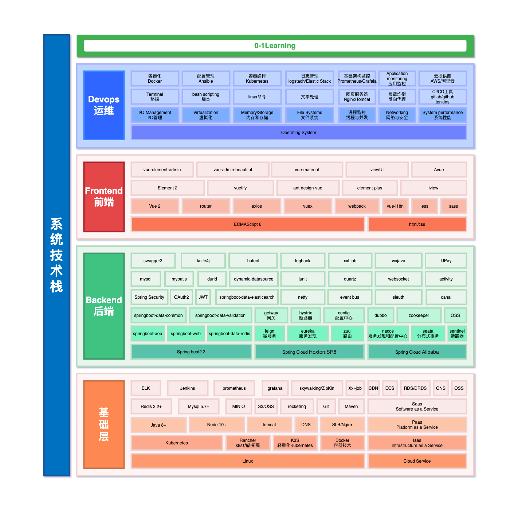

# timber-android

## 项目介绍（Project Introduction）

项目取名timber——`木材`，寓意人类从刀耕火种逐渐进化的源头，星星之火，可以燎原，愿这个项目也可以成为开发者入门的源头。

这是一个实现`0-1Learning`这个项目所有的知识点的实现项目，包括的Java backend(后端)，web frontend(前端)，Android App，ios App、小程序等一整套的项目合集，可以让你一次性接触到任何一端的项目开发流程是怎么样的（yes,so cool）

你可以选择从`0-1`实现任何一端开始学习项目开发，也可以先写好后端服务及接口、再写前端、和App等项目。

任何一端的项目都可以拷贝到本地直接运行，构建你自己的本地服务。

如果想搞懂更多的项目知识体系，更多项目所有技术文档都在 [0-1Learning](http://github.com/soonphe/0-1Learning) 中有完整介绍，欢迎前往阅读。

### 设备支持（Equipment Support）

设备支持：`java`,`web`、`android`、`ios`、`小程序`

### 项目地址（Project Address）
- java backend：[timber-web](http://github.com/soonphe/timber)
- web frontend：[timber-web](http://github.com/soonphe/timber-web)
- android APP：[timber-android](http://github.com/soonphe/timber-android)
- ios App：[timber-ios](http://github.com/soonphe/timber-ios)
- 小程序：[timber-applets](http://github.com/soonphe/timber-applets)

### 业务支持（Business Support）

- 广告业务：支持广告智能投放，自动上架与下架，广告覆盖有效统计
- 电影业务：对接xx电影网
- 视频业务：小视频点播
- 音乐业务：音乐播放、下载
- 小说业务：文件上传和爬虫抓取
- 新闻业务：定期抓取
- 游戏业务：html游戏
- 城市特色业务：城市介绍，衣食住行、景点、广告引流

### 业务功能模块（Functional Module）

```
├── 系统模块
    ├── 用户统一管理后台系统UUM
    └── 权限系统模块
├── 业务模块
    ├── 广告模块
    ├── 电影模块
    ├── 视频模块
    ├── 音乐模块
    ├── 小说模块
    ├── 新闻模块
    ├── 游戏模块
    └── 城市模块
├── 搜索模块
├── 三方功能模块
└── 数据模块
    ├── 埋点模块
    └── 统计模块
```

### 高可用分布式系统架构（Highly available distributed system architecture）


### 系统技术栈（System Technology Stack）


### 项目结构（Project Structure）
```
timber-android
├── app:
    ├── src:
        ├── assets：数据库配置
        ├── java：
            ├── adapter：recycleview适配器
            ├── api：http请求模块 *
                ├── api：接口请求定义
                └── serveice：接口封装
            ├── base：基类封装 *
            ├── components：封装网络请求
            ├── constants：静态类
            ├── di：依赖注入组件
            ├── entity：实体
            ├── pojo：持久化
            ├── receiver：广播监听
            ├── services：服务
            ├── ui：界面模块 *
                ├── ...：业务界面...
                ├── fragment：fragment模块
                    ├── center：商城
                    ├── home：首页
                    ├── mine：我的
                    └── msg：消息
                ├── main：主界面activity，包含多个fragment
                ├── splash：闪屏页activity
                └── unlock：解锁页activity
            ├── utils：工具类
            └── widget：组件
        ├── res：静态资源（布局、图片、文字、颜色等）
        └── AndroidManifes.xml：android清单
    ├── build.gradle: gradle构建    
    ├── debug.keystore: 签名打包
    ├── Key.jks: 签名
    └── proguard-rules.pro：混淆
├── timber-widget: 自定义组件模块
    ├── amount：自定义加减输入框（已完成）
    ├── banner：自定义banner
    ├── banner：自定义menu（已完成）
    ├── statusbar：自定义状态栏（已完成）
    ├── tablayout：自定义tablayout
    ├── titlebar：自定义apptitle(左侧返回，中间标题，右侧文字)（已完成）
    └── unlock：自定义解锁画面（已完成）
├── build.gradle: 基础gradle构建配置
├── config.gradle: 统一gradle版本配置
├── README.md -- 说明
└── settings.gradle: 项目配置

备注：标 * 的为重点模块
```

### 项目架构（System Architecture）

#### 1.基础项目架构（Base Framework）
+ 网络框架：okhttp3 + retrofit2
+ 异步框架：rxjava2
+ view依赖注入：butterknife
+ 组件依赖注入：Dagger
+ RPC数据解析：gson + fastjson
+ 日志：logger
+ 网络监控：fackbook stetho
+ 组件通信：EventBus
+ 数据库：Litepal
+ 网页加载：agentweb + 腾讯X5内核
+ 热修复+更新：bugly + tinker
+ JDK：1.8 + retrolambda表达式

#### 2.控件库（Widget Library）
+ 图片加载：Glide + 头像circleimageview
+ 图片选择：知乎matisse
+ 控件徽章：BadgeView
+ 控件切换：SwitchButton
+ 列表加载：BaseRecyclerViewAdapterHelper + easyrecyclerview
+ 进度条：WangAvi
+ 弹出框：material-dialogs
+ 菜单列表：FlycoTabLayout_Lib + VerticalTabLayout
+ 轮播图：banner

#### 3.工具库（Tools Library）
+ 上传下载：okgo + okserver
+ 图片压缩：Luban
+ 上拉刷新，下拉加载更多：SmartRefreshLayout
+ 小说阅读器：HwTxtReader
+ PDF阅读器：android-pdf-viewer
+ 表单验证：saripaar
+ 动态权限请求：rxpermissions
+ 动画库：nineoldandroids
+ 音视频播放器：jiaozivideoplayer
+ 中文转拼音：jpinyin
+ 定位：高德+citypicker
+ html解析：jsoup
+ 工具类：blankj
+ 一键换肤
+ 极光推送

### 工作进度（Work Progress）
- gradle更新（官网）（当前gradle插件4.2.0，gradle 6.7.1）
  - gradle版本对应关系：https://developer.android.google.cn/studio/releases/gradle-plugin.html#updating-plugin
  - 去除jcenter，Jfrog，使用mavenCenter依赖更新（central仓库地址：central.sonatype.com）
    - google仓库：在gradle4.1之后，添加了新的语法google()，用于引用google自有的仓库。很方便，但是不便于研究被依赖的aar源文件。
    - jenter：属于jfrog，已停用，不能上传新包，不过可以下载（原有jcenter仅支持下载-已启动），jcenter是由 bintray.com维护的Maven仓库。可以在jcenter.bintray.com/看到整个仓库的内容。
    - Jfog已停用
    - mavenCentral：由sonatype.org维护的Maven仓库。可以在repo1.maven.org/maven2/看到整个仓库。
    * JitPack：那么这和 Maven Central，JCenter 有何不同呢？最大的区别就在于你不必完成 Maven Central 的一系列注册手续，乃至发布一个库之前的登记 Post 和等待管理员批准，也不必在 JCenter 上填写冗长的标签，找图做图做图标写说明，更不必每到发布时做一系列的准备工作，使用专用的工具完成最后一击。你只需要写好你的 GitHub Repo README就行了，其他的事情，JitPack 会全数包办。
    - build：推荐使用maven center和jitpack，参考：https://blog.csdn.net/2401_84104728/article/details/137532001
    - gradle更新：当前4.2.0（最新8.3，支持sdk34.0.0，参考文档：https://developer.android.google.cn/build/releases/past-releases/agp-8-3-0-release-notes?hl=en）
    - gradle plugin更新：当前6.7.1（最新版本8.8）
    - 新增maven仓库地址：maven { url "https://s01.oss.sonatype.org/content/groups/public" }

- 全面使用androidX + jetpack✔️
  - androidX是针对android support的一次更新
  * 第一，包名。之前Android Support Library中的API，它们的包名都是在android.support.下面的，而AndroidX库中所有API的包名都变成了在androidx.下面。
  * 第二，命名规则。吸取了之前命名规则的弊端，AndroidX所有库的命名规则里都不会再包含具体操作系统API的版本号了。比如，像appcompat-v7库，在AndroidX中就变成了appcompat库。
- 项目gradle依赖更新
  - 基础androidx，Dagger，rxjava3，retrofit，rxlife,okhttp✔️
  - tools依赖
  - ui、widget依赖
- 项目极简化拆分，基础代码更新
  - baseApplication重写✔️
  - MyAppliation重写
    - 去除推送、bugly、tinker、okgo等配置✔️
  - baseActivity重写✔️
  - BaseFragment重写✔️
  - dagger 依赖注入重写✔️
  - 基础适配器(基于RecyclerView.Adapter，暂缓)
  - 网络组件重写
    - 使用本地IP，重写convert✔️
    - okhttp，retrofit更新✔️
    - API参数变更✔️
    - json解析
  - 动态权限请求✔️

- UI重写
  - unlock页，使用widget✔️
  - falsh页重写✔️
    - 网络请求获取闪屏页图片✔️
    - 倒计时、倒计时可跳过✔️
    - 判断网络是否可用、网络运营商名称✔️
  - main页面重写（使用viewpager嵌套fragment + CommonTabLayout联动切换）
    - 首页（带定位搜索apptitle、banner、munu、recycleView、swipeView下拉刷新）（已完成）
    - 商城(titlebar)✔️
      - 多模块点击跳转
      - MaterialDialog弹窗✔️
      - agentweb加载网页✔️
    - 消息(titlebar)✔️
    - 我的（折叠toolbar+apptitle、list、login跳转）✔️
    - 组件更新
      - android.support.v7.widget.RecyclerView——androidx.recyclerview.widget.RecyclerView✔️
      - android.support.v7.widget.CardView——androidx.cardview.widget.CardView✔️
      - pushdialog调整✔️
      - viewpager升级- viewpager2✔️
      - tablayout升级- tablayout2
      - banner升级- banner2
      - 适配器更新（暂缓）
      
- 自定义小组件：
  - 自定义解锁画面（已完成）
  - 自定义状态栏（已完成）
  - 自定义menu（已完成）
  - 自定义apptitle(左侧返回，中间标题，右侧文字)（已完成）
  - 自定义banner
  - 自定义加减输入框（已完成）
  - 自定义tablayout
  - 悬浮球(权限问题)

- 通用工具类：
  - 基础工具类：spUtil编写，logUtil编写
  - 数据库操作——参考Litepal
    - Android SQLiteOpenHelper Android SDK 默认提供的SQLite方案。 SQLite low-level API，Raw SQL queries 使用比较繁琐
    - Android Jetpack Room Jetpack 新组件。 SQLite 之上的 ORM 抽象层。
    - SQLDelight Square 开源的数据库框架。 使用 Kotlin DSL 生成 Java 代码。

- 调试debug：
  - 安装copilot✔️
  - android调试：在chrome的地址栏输入chrome://inspect, 可以看到当前连接的设备，然后点击inspect按钮✔️
  - android日志：Logcat✔️
  - android模拟器AVD访问本机开发环境(在在模拟器上可以用10.0.2.2代替127.0.0.1和localhost)✔️

- 其他问题
**Apps targeting Android12 and higher are required to specify...**
如果应用以 >=Android 12 或更高版本为目标平台，且包含使用 intent 过滤器的 activity、服务或广播接收器，您必须为这些应用组件显式声明 android:exported 属性。目的就是Android 12 提高了app和系统的安全性。
如果设为“true”，那么 Activity 可由任何应用访问，并且可通过其确切类名称启动。
如果设为“false”，则 Activity 只能由同一应用的组件、使用同一用户 ID 的不同应用或具有特权的系统组件启动。 没有 intent 过滤器时，这是默认值。

**Android解决设备ID获取异常 java.lang.SecurityException: getDeviceId: The user 10612 does not meet the require**
受此影响，在Android10( Target API 提升到了 30 之后)以及之后的版本想通上述代码获取设备ID或者IMEI号都无法实现，这里我们总结一下具体有哪些API无法调用
```
Build
getSerial()
TelephonyManager
getImei()
getDeviceId()
getMeid()
getSimSerialNumber()
getSubscriberId()
```

**android:screenOrientation="portrait" 不推荐**
解决方案通常是让Activity根据用户的屏幕旋转做出相应的调整。可以通过在Activity中重写onConfigurationChanged()方法来处理屏幕旋转的情况：
```
java
@Override
public void onConfigurationChanged(Configuration newConfig) {
super.onConfigurationChanged(newConfig);
// 根据newConfig中的信息做出相应的处理，如重新加载布局或者数据
}
同时，在AndroidManifest.xml中为该Activity添加屏幕方向改变的权限：

xml
<activity
android:name=".YourActivity"
android:configChanges="orientation|screenSize"
android:screenOrientation="sensor">
</activity>
```
也可以在application添加标签
```
解决方法：
application标签下加入：

xmlns:tool="http://schemas.android.com/tools"
tool:ignore="LockedOrientationActivity"
```

**java.lang.IllegalArgumentException: No Retrofit annotation found. (parameter**
问题定位：Retrofit方法参数错误
```
interface ApiService {
    @GET("users/{id}")
    Call<User> getUser(@Path("id") int userId);
 
    @POST("users/new")
    Call<User> createUser(@Body User user);
 
    @GET("users/search")
    Call<List<User>> searchUsers(@Query("name") String name);
}
```

**定位信息问题**
java.lang.UnsupportedOperationException: GpsStatus APIs not supported, please use GnssStatus APIs instead

**自定义menu加载问题**
java.lang.IllegalArgumentException: You cannot start a load for a destroyed

**rxlife**
RxLife 是由 Liu Jingxing 创建的一个开源项目，它的核心理念是为开发者提供一种更简单的方法来管理和控制RxJava流在Android组件（如Activity或Fragment）生命周期中的行为。通过使用RxLife，你可以避免资源泄漏，同时确保你的代码在正确的时间执行和停止执行。
该项目的核心是LifecycleTransformer接口，它扩展了RxJava的Transformer类，让开发者能够轻松地将生命周期事件映射到Observable的操作上。例如，你可以创建一个只在Activity处于可见状态时触发的Observable，或者一个在Activity销毁时自动取消的Observable。

**FileProvider**
从 Android 7.0 开始，应用私有目录的访问权限被做限制。具体表现为，开发人员不能够再简单地通过 file:// URI 访问其他应用的私有目录文件或者让其他应用访问自己的私有目录文件
同时，也是从 7.0 开始，Android SDK 中的 StrictMode 策略禁止开发人员在应用外部公开 file:// URI。具体表现为，当我们在应用中使用包含 file:// URI 的 Intent 离开自己的应用时，程序会发生故障。
开发中，如果我们在使用 file:// URI 时忽视了这两条规定，将导致用户在 7.0 及更高版本系统的设备中使用到相关功能时，出现 FileUriExposedException 异常，导致应用出现崩溃闪退问题。而这两个过程的替代解决方案便是使用 FileProvider。

上面的关键点：应用程序的私有目录。 私有目录：data/app/包名" 和 "data/data/包名。随着app卸载被删除。 公共目录：包括外部公共目录、外部私有目录、缓存目录

私有目录：随着用户删除app而删除
context.getCacheDir(); /data/data/包名/cache
context.getFilesDir(); /data/data/包名/files
注意：Android7.0以上区分用户目录是这个： /data/user/0/包名/cache、/data/user/0/包名/files，这个不用太在意它，其实指向的还是data/data目录。

外部私有目录：随着用户删除app而删除
context.getExternalFilesDir(type); /storage/emulated/0/Android/data/包名/files
context.getExternalCacheDir(); /storage/emulated/0/Android/data/包名/cache

外部公共目录：
Environment.getExternalStoragePublicDirectory(type)；
/storage/emulate/0/…
有九种type，分别对应不同的目录，如下：
DIRECTORY_MUSIC：音乐类型 /storage/emulate/0/music
DIRECTORY_PICTURES：图片类型
DIRECTORY_MOVIES：电影类型
DIRECTORY_DCIM：照片类型,相机拍摄的照片视频都在这个目录（digital camera in memory）
DIRECTORY_DOWNLOADS：下载文件类型 /storage/emulate/0/downloads
DIRECTORY_DOCUMENTS：文档类型
DIRECTORY_RINGTONES：铃声类型
DIRECTORY_ALARMS：闹钟提示音类型
DIRECTORY_NOTIFICATIONS：通知提示音类型

外部根目录：
Environment.getExternalStorageDirectory()；/storage/emulate/0

1.第一步
//android:grantUriPermissions="true"允许它授予 Uri 临时的权限。

2.第二步 ：在res/xml 目录下添加共享目录标识文件file_path


## 公众号

`0-1Learning`项目全套学习教程连载中，关注公众号「**罗晓胜**」第一时间获取。

加微信群交流，公众号后台回复「**加群**」即可。


